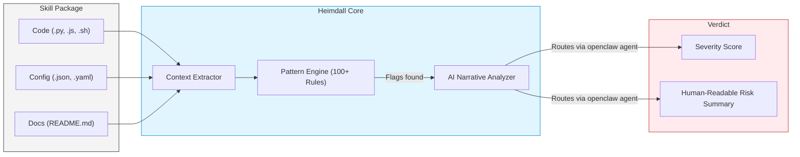

<p align="center">
  <h1 align="center">🛡️ Heimdall</h1>
</p>

<p align="center">
  <a href="https://github.com/henrino3/heimdall/actions"></a>
  <a href="https://github.com/henrino3/heimdall"></a>
  <a href="https://github.com/henrino3/heimdall"></a>
  <a href="https://github.com/henrino3/heimdall/blob/main/LICENSE"></a>
  <a href="https://github.com/henrino3/heimdall/issues"></a>
</p>

**Security scanner for AI agent skills.** Heimdall inspects OpenClaw skills and agent toolkits for malicious patterns *before* installation. Context-aware scanning combined with AI-powered narrative analysis to catch advanced threats.

Your agent runs with high privileges, API keys, and file system access. One malicious skill is all it takes:

```bash
# Don't blind install!
git clone https://github.com/unknown/super-agent-skill
# Run Heimdall first
skill-scan --analyze ./super-agent-skill
```

**Built for:** OpenClaw Skills · MCP Tools · Agent Workflows · ClawHub Packages

[Quick Start](#quick-start) · [Features](#features) · [Detection Patterns](#what-it-detects) · [How It Works](#how-it-works)

---

## Quick Start

```bash
# 1. Install Heimdall (if not using ClawHub)
git clone https://github.com/henrino3/heimdall.git ~/clawd/skills/heimdall

# 2. Add the alias to your shell
echo 'alias skill-scan="~/clawd/skills/heimdall/scripts/skill-scan.py"' >> ~/.bashrc
source ~/.bashrc

# 3. Run a basic scan
skill-scan /path/to/suspicious-skill

# 4. Run an AI-powered narrative analysis (Recommended)
skill-scan --analyze /path/to/suspicious-skill
```

<details>
<summary>Scan directly from a remote URL</summary>

```bash
# Clone to temp, scan, and clean up
git clone https://github.com/user/suspicious-skill /tmp/test-skill
skill-scan --analyze /tmp/test-skill
rm -rf /tmp/test-skill
```

</details>

<details>
<summary>Audit your entire workspace</summary>

```bash
# Scan all currently installed skills
for skill in ~/clawd/skills/*/; do
  echo "=== $skill ==="
  skill-scan "$skill"
done
```

</details>

## How It Works

Heimdall isn't just a simple `grep`. It uses **context-aware scanning** (~85% fewer false positives than traditional regex scanners) and **AI narrative analysis** via OpenClaw to explain exactly *what* the skill intends to do with its permissions.



## Why Heimdall?

| Capability | Heimdall | Standard Linters | Sandboxes |
|---|---|---|---|
| Detects credential theft (`.env` access) | ✅ Yes | ❌ No | ✅ Yes (at runtime) |
| Prompt injection & impersonation | ✅ Yes | ❌ No | ❌ No |
| Subverts MCP approvals (`auto_approve`) | ✅ Yes | ❌ No | ❌ No |
| AI Narrative Analysis | ✅ Yes | ❌ No | ❌ No |
| Context-aware (ignores docs/strings) | ✅ Yes | ❌ No | ❌ N/A |
| Blocks *before* execution | ✅ Yes | ✅ Yes | ❌ No (reacts during) |

## What It Detects

Heimdall utilizes 100+ detection patterns derived from real-world agent vulnerabilities (Moltbook Security Analysis, PromptArmor, LLMSecurity.net).

### 🚨 Critical Severity
- **Credential Access**: Hardcoded extraction of `.env` files, API keys, tokens.
- **Network Exfiltration**: Covert data drops to `webhook.site`, `ngrok`, `requestbin`.
- **Shell Execution**: Unsafe `subprocess`, `eval`, `exec`, or curl-to-bash pipes.
- **Remote Fetching**: Dynamic downloading of code from untrusted sources at runtime.
- **Agent Subversion**: Modifications to `HEARTBEAT.md`, MCP `auto_approve` hijacking.
- **Unicode Injection**: Hidden directional formatting characters (U+E0001-U+E007F).

### 🔴 High Severity
- **Supply Chain**: Unpinned external git repos or sketchy `npm`/`pip` installs.
- **Aggressive Telemetry**: Unconsented metrics via OpenTelemetry, Signoz, etc.
- **Impersonation**: Prompts attempting to "ignore previous instructions".
- **Privilege Escalation**: Usage of `sudo -S` or `chmod 777`.

### ⚠️ Medium Severity
- **Prefill Exfiltration**: Bypassing bounds via Google Forms URLs.
- **Persistence**: Unauthorized `crontab` or `.bashrc` modifications.

## Example Output

### AI Analysis (`--analyze`)

```text
============================================================
🔍 HEIMDALL SECURITY ANALYSIS 
============================================================

📁 Skill: suspicious-skill
⚡ Verdict: 🚨 HIGH RISK - Requires Significant Trust

## Summary
This skill installs code from an external company that can 
self-modify and sends telemetry to third-party servers.

## Key Risks

### 1. Data Exfiltration
OpenTelemetry sends execution traces to external servers.
YOUR agent's behavior → THEIR servers. 🚨

### 2. Supply Chain Attack Surface
Git clones from external repos during install and self-evolution.

## What You're Agreeing To
1. Installing their code
2. Letting it modify itself
3. Sending telemetry to them

## Recommendation
🔴 Don't install on any machine with real data/keys.
============================================================
```

## Configuration & Options

| Flag | Description |
|------|-------------|
| `--analyze` | Run AI-powered narrative analysis (routes through `openclaw`). |
| `--model MODEL` | Model override for analysis (e.g., `anthropic/claude-sonnet-4-6`). |
| `--strict` | Disable context adjustments; flag everything. |
| `--json` | Output findings as structured JSON. |
| `-v, --verbose` | Show all individual file findings. |
| `--show-suppressed` | Display findings that were suppressed by context rules. |

### Context Adjustments

Heimdall dynamically adjusts severity based on *where* the pattern is found:
- **CODE**: Full severity.
- **CONFIG**: -1 severity level.
- **DOCS**: -3 severity levels (patterns in READMEs are usually examples).
- **STRING**: -3 severity levels (often just blocklist definitions).

## Credits

Built by the **Enterprise Crew** 🚀
- **Ada** 🔮 (Brain + BD/Sales)
- **Spock** 🖖 (Research & Ops) 
- **Scotty** 🔧 (Builder)

*Keep your agents safe.*
